# 🗺️ The DSA Pattern Mapper

<div align="center">


### A visual mental model for mastering Data Structures & Algorithms interviews.

Instead of memorizing solutions, learn how to **recognize patterns** instantly.

</div>

---

# 📌 What Is This?

The **DSA Pattern Mapper** is a visual roadmap designed to help you identify the correct algorithmic pattern for coding interview problems.

Most interview candidates fail because they:

* memorize solutions,
* forget implementations,
* panic under pressure,
* or cannot identify the underlying pattern.

This roadmap fixes that problem by training:

* **pattern recognition**
* **problem classification**
* **algorithm selection**
* **optimization thinking**

---

# 🎯 Who Is This For?

✅ LeetCode learners
✅ FAANG interview preparation
✅ Competitive programmers
✅ College DSA students
✅ Placement preparation
✅ Revision before interviews
✅ Anyone struggling with "Which algorithm should I use?"

---

# 🧠 Core Philosophy

> Strong problem solvers don't memorize problems.
> They recognize patterns.

This roadmap helps you think like an interviewer:

* Is the array contiguous?
* Is the data sorted?
* Is there overlap?
* Is it shortest path?
* Are states repeating?
* Is greedy valid?
* Is recursion natural here?

Once you identify the pattern family, solving becomes dramatically easier.

---

# 📊 Ultimate DSA Flowchart

> GitHub natively renders Mermaid diagrams.
> You can zoom in or export them as SVG/PNG.

```mermaid
%%{init: {
  "theme": "base",
  "themeVariables": {
    "background": "#ffffff",

    "primaryColor": "#ffffff",
    "primaryTextColor": "#111827",
    "primaryBorderColor": "#2563eb",

    "secondaryColor": "#ffffff",
    "tertiaryColor": "#ffffff",

    "lineColor": "#64748b",

    "clusterBkg": "#ffffff",
    "clusterBorder": "#cbd5e1",

    "fontFamily": "Inter"
  }
}}%%

flowchart TD

    A([🚀 Start problem]) --> B{What is the input type?}

    B -->|Array / String| AS1
    B -->|Tree| TR1
    B -->|Graph / Matrix| GR1
    B -->|Linked List| LL1
    B -->|Math / Bitwise| MB1
    B -->|Unknown| U1[Clarify constraints, examples, and output]

    %% =========================
    %% ARRAY / STRING
    %% =========================
    subgraph ARRAY[📘 Array / String Patterns]
        direction TB

        AS1{Contiguous subarray / substring?}
        AS1 -->|Yes| AS2{Fixed / Longest / Shortest window?}
        AS2 -->|Yes| SW[Sliding Window]
        AS2 -->|No| AS3{Subarray sum / count?}
        AS3 -->|Yes| AS4{Negative numbers present?}
        AS4 -->|Yes| PSH[Prefix Sum + HashMap]
        AS4 -->|No| TPW[Two Pointers / Sliding Window]
        AS3 -->|No| AS5{Need frequency / lookup?}
        AS5 -->|Yes| HSH[HashMap / HashSet]
        AS5 -->|No| AS6{Can local optimal choices build global optimal?}
        AS6 -->|Yes| GREEDY[Greedy]
        AS6 -->|No| SIM[Simulation]

        AS1 -->|No| AS7{Optimize minimum / maximum answer?}
        AS7 -->|Yes| BSANS[Binary Search on Answer]
        AS7 -->|No| AS8{Sorted / Monotonic?}

        AS8 -->|Yes| AS9{Search target / boundary?}
        AS9 -->|Yes| BS[Binary Search]
        AS9 -->|No| TP[Two Pointers]

        AS8 -->|No| AS10{Need repeated top-K / min / max?}
        AS10 -->|Yes| HEAP[Heap / Priority Queue]
        AS10 -->|No| AS11{Next greater / smaller element?}
        AS11 -->|Yes| STACK[Monotonic Stack]
        AS11 -->|No| AS12{Combinations / permutations?}
        AS12 -->|Yes| BT[Backtracking]
        AS12 -->|No| AS13{Repeated overlapping states?}
        AS13 -->|Yes| DP[Dynamic Programming]
        AS13 -->|No| AS14{Intervals / overlaps / meetings?}
        AS14 -->|Yes| INT[Intervals + Sorting + Greedy]
        AS14 -->|No| AS15{Prefix search / dictionary words?}
        AS15 -->|Yes| TRIE[Trie / Prefix Tree]
        AS15 -->|No| AS16{Can the problem be split into independent halves?}
        AS16 -->|Yes| DNC[Divide & Conquer / Recursion]
        AS16 -->|No| AS17{Need custom structure with constant time operations?}
        AS17 -->|Yes| DESIGN[Custom Data Structure Design]
        AS17 -->|No| SIM
    end

    %% =========================
    %% TREE
    %% =========================
    subgraph TREE[🌳 Tree Patterns]
        direction TB

        TR1{Level-wise traversal?}
        TR1 -->|Yes| TBFS[Tree BFS / Level Order]
        TR1 -->|No| TR2{BST properties involved?}
        TR2 -->|Yes| BST[BST / Inorder Traversal]
        TR2 -->|No| TR3{Path / Height / Diameter / LCA?}
        TR3 -->|Yes| TDFS[DFS / Recursive Tree Traversal]
        TR3 -->|No| TR4[Tree Construction / Manipulation]
    end

    %% =========================
    %% GRAPH / MATRIX
    %% =========================
    subgraph GRAPH[🕸️ Graph / Matrix Patterns]
        direction TB

        GR1{Connectivity / islands / components?}
        GR1 -->|Yes| BFSDFS[BFS / DFS]
        GR1 -->|No| GR2{Shortest path?}
        GR2 -->|Unweighted| BFS[BFS]
        GR2 -->|Weighted Positive| DIJK[Dijkstra]
        GR2 -->|Negative Weights| BF[Bellman-Ford]
        GR2 -->|No| GR3{Dependencies / ordering?}
        GR3 -->|Yes| TOPO[Topological Sort / Kahn's]
        GR3 -->|No| GR4{Dynamic connectivity?}
        GR4 -->|Yes| DSU[Union Find / DSU]
        GR4 -->|No| GR5[Advanced Graphs / Grid Simulation]
    end

    %% =========================
    %% LINKED LIST
    %% =========================
    subgraph LINKED[🔗 Linked List Patterns]
        direction TB

        LL1{Cycle / middle / kth node?}
        LL1 -->|Yes| FASTSLOW[Fast & Slow Pointer]
        LL1 -->|No| LL2{Reverse / merge / reorder?}
        LL2 -->|Yes| LL3[In-place Manipulation]
        LL2 -->|No| LL4[Dummy Node / Pointer Handling]
    end

    %% =========================
    %% MATH / BITWISE
    %% =========================
    subgraph MATH[🧠 Math / Bit Manipulation]
        direction TB
        MB1{Bitwise operations?}
        MB1 -->|Yes| BIT[Bitmasking / XOR]
        MB1 -->|No| MB2{Prime / GCD / Geometry?}
        MB2 -->|Yes| MATH2[Math / Number Theory]
        MB2 -->|No| MB3[Observation / Pattern Logic]
    end

    %% =========================
    %% DP SPECIALIZATION
    %% =========================
    DP --> DP1{Which DP family?}
    DP1 -->|Linear| DP_LINEAR[1D DP]
    DP1 -->|Grid| DP_GRID[Grid DP]
    DP1 -->|Subsequence| DP_SUB[LIS / LCS / Edit Distance]
    DP1 -->|Interval| DP_INT[Interval DP]
    DP1 -->|Tree| DP_TREE[Tree DP]
    DP1 -->|Bitmask| DP_BIT[Bitmask DP]

    %% =========================
    %% SOLVE / END
    %% =========================
    SOLVE[Identify Pattern → Apply Template → Code → Test Edge Cases]
    END([Done])

    SW & PSH & TPW & HSH & GREEDY & SIM & BSANS & BS & TP & HEAP & STACK & BT & DP & INT & TRIE & DNC & DESIGN --> SOLVE
    TBFS & BST & TDFS & TR4 --> SOLVE
    BFSDFS & BFS & DIJK & BF & TOPO & DSU & GR5 --> SOLVE
    FASTSLOW & LL3 & LL4 --> SOLVE
    BIT & MATH2 & MB3 & U1 --> SOLVE
    DP_LINEAR & DP_GRID & DP_SUB & DP_INT & DP_TREE & DP_BIT --> SOLVE

    SOLVE --> END

    %% =========================
    %% STYLES
    %% =========================
    classDef start fill:#dcfce7,stroke:#16a34a,color:#111827,stroke-width:3px;
    classDef decision fill:#fef3c7,stroke:#d97706,color:#111827,stroke-width:2px;
    classDef process fill:#eff6ff,stroke:#2563eb,color:#111827,stroke-width:1.5px;
    classDef special fill:#f3e8ff,stroke:#9333ea,color:#111827,stroke-width:2px;

    class A,END start;
    class B,AS1,AS2,AS3,AS4,AS5,AS6,AS7,AS8,AS9,AS10,AS11,AS12,AS13,AS14,AS15,AS16,AS17,TR1,TR2,TR3,GR1,GR2,GR3,GR4,LL1,LL2,MB1,MB2,DP1 decision;
    class SW,PSH,TPW,HSH,GREEDY,SIM,BSANS,BS,TP,HEAP,STACK,BT,DP,INT,TRIE,DNC,DESIGN,TBFS,BST,TDFS,TR4,BFSDFS,BFS,DIJK,BF,TOPO,DSU,GR5,FASTSLOW,LL3,LL4,BIT,MATH2,MB3,U1,SOLVE,DP_LINEAR,DP_GRID,DP_SUB,DP_INT,DP_TREE,DP_BIT process;
```



---

# ⚡ Pattern Recognition Cheat Sheet

| Problem Clue                   | Likely Pattern               |
| ------------------------------ | ---------------------------- |
| Longest substring              | Sliding Window               |
| Smallest window                | Sliding Window               |
| Subarray sum = K               | Prefix Sum                   |
| Sorted array                   | Binary Search / Two Pointers |
| K largest / K closest          | Heap                         |
| Next greater element           | Monotonic Stack              |
| Dependency ordering            | Topological Sort             |
| Islands / connected components | BFS / DFS                    |
| Shortest path                  | BFS / Dijkstra               |
| Repeated states                | Dynamic Programming          |
| Merge overlapping intervals    | Intervals                    |
| Generate all possibilities     | Backtracking                 |
| Prefix matching / autocomplete | Trie                         |
| O(1) operations                | Custom Data Structure        |
| Split into halves recursively  | Divide & Conquer             |

---

# 🧩 Common Interview Triggers

## Sliding Window

Keywords:

* longest
* shortest
* contiguous
* substring
* subarray
* at most K
* exactly K

Complexity:

```text
O(n)
```

---

## Binary Search

Keywords:

* sorted
* monotonic
* minimum possible
* maximize minimum
* search space

Complexity:

```text
O(log n)
```

---

## Heap / Priority Queue

Keywords:

* top K
* smallest K
* kth largest
* nearest / closest

Complexity:

```text
O(n log k)
```

---

## Dynamic Programming

Keywords:

* overlapping states
* minimize cost
* maximize profit
* count ways

Common DP Families:

* 1D DP
* Grid DP
* LIS / LCS
* Tree DP
* Bitmask DP

---

# 🧪 Interview Checklist

Before coding:

```text
✓ Understand constraints
✓ Clarify edge cases
✓ Is input sorted?
✓ Are duplicates present?
✓ Are negative numbers present?
✓ Can brute force be optimized?
✓ Is recursion safe?
✓ Is greedy valid?
✓ Time complexity acceptable?
✓ Space complexity acceptable?
```

---

# 📥 How To Use

## Option 1 — GitHub Rendering

GitHub automatically renders Mermaid diagrams.

Simply:

1. Open the README
2. Zoom in
3. Follow the decision tree

---

## Option 2 — Mermaid Live Editor

Paste the Mermaid code into:

```text
https://mermaid.live
```

You can:

* export SVG,
* generate PNG,
* customize themes,
* create posters.

---

## Option 3 — Printable PDF

Use:

```text
Ctrl + P
```

Then:

```text
Save as PDF
```

Perfect for:

* interview revision,
* wall posters,
* study notes.

---

# 🚀 Future Improvements

Planned additions:

* Segment Tree roadmap
* Advanced graph algorithms
* Competitive programming version
* Interactive website
* Clickable explanations
* Pattern-wise templates
* LeetCode problem mapping

---

# 🤝 Contributions

PRs are welcome.

You can contribute:

* new patterns,
* visual improvements,
* missing algorithms,
* typo fixes,
* optimization hints,
* better examples.

---

# ⭐ Support

If this repository helped you:

* ⭐ Star the repo
* 🍴 Fork it
* 📢 Share it with friends preparing for interviews

---

# 📜 License

MIT License

Feel free to use, modify, and distribute.

---

<div align="center">

## 💡 Learn Patterns. Not Memorization.

### Crack interviews by thinking like a problem solver.

</div>
